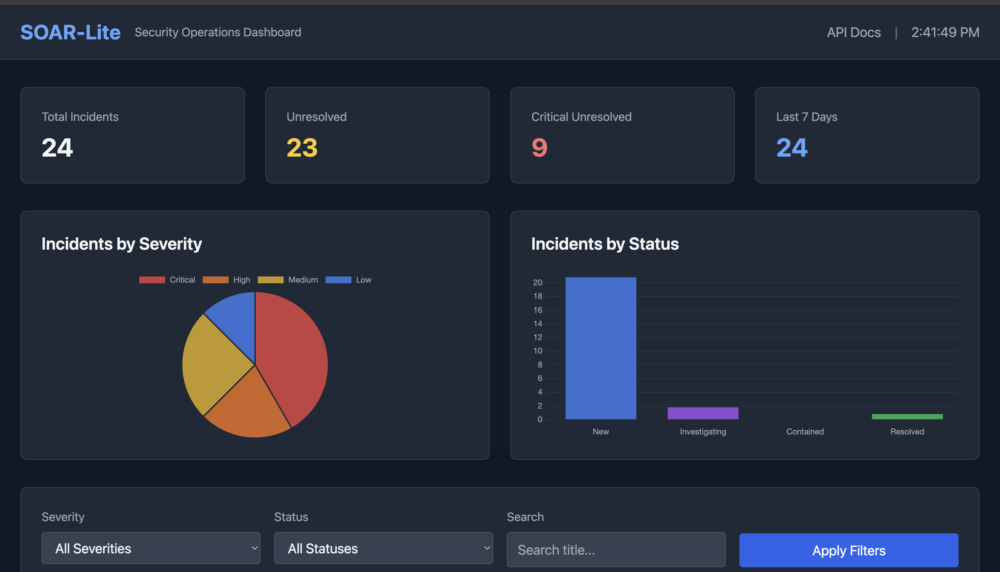
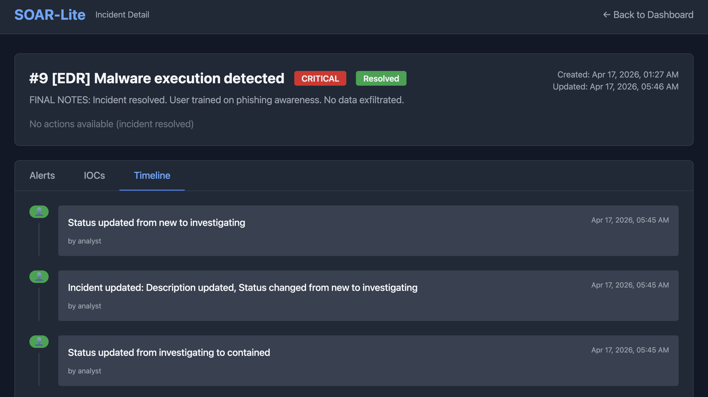

# SOAR-Lite

> Lightweight Security Orchestration, Automation & Response platform demonstrating SOC workflow orchestration, threat intelligence enrichment, and automated playbook execution.

# SOAR-Lite


[](https://github.com/AhmedDAH1/soar-lite)

> Lightweight Security Orchestration, Automation & Response platform demonstrating SOC workflow orchestration, threat intelligence enrichment, and automated playbook execution.
## 🎯 Project Status

**Current Milestone:** 0 - Foundation ✅  
**Next Up:** Alert Ingestion API

## 🏗️ Architecture

- **Backend:** FastAPI (Python 3.10+)
- **Database:** SQLite (→ PostgreSQL for production)
- **Task Processing:** asyncio
- **Testing:** pytest

## 🚀 Quick Start

```bash
# Clone and setup
git clone <your-repo>
cd soar-lite
python3 -m venv venv
source venv/bin/activate
pip install -r requirements.txt

# Run migrations
alembic upgrade head

# Start server
uvicorn app.main:app --reload
```

Visit http://127.0.0.1:8000/docs for API documentation.

## 🧪 Testing

```bash
pytest -v
```
## 🖥️ Dashboard

SOAR-Lite includes a web-based dashboard for incident management:

### Features
- **Real-time metrics** - Total incidents, unresolved count, critical alerts
- **Visual analytics** - Severity and status distribution charts
- **Advanced filtering** - Search by severity, status, title, or IOC
- **Incident timeline** - Full audit trail with system and manual actions
- **One-click status updates** - Enforce workflow validation
- **IOC enrichment** - Trigger threat intelligence lookups from UI


## 🔗 Webhook Integration

SOAR-Lite accepts real-time alerts from external security tools via webhooks.

### Supported Sources
- **SIEM** (Splunk, QRadar, ELK) - `/api/webhooks/siem`
- **EDR** (CrowdStrike, SentinelOne) - `/api/webhooks/edr`
- **Email Gateway** (Proofpoint, Mimecast) - `/api/webhooks/email`
- **Generic** (Custom tools) - `/api/webhooks/generic`

### Example: Configure Splunk to Send Alerts

```bash
# Splunk webhook action
curl -X POST http://your-soar.com/api/webhooks/siem \
  -H "Content-Type: application/json" \
  -d '{
    "search_name": "$alert_name$",
    "result": $result$,
    "severity": "$severity$"
  }'
```

### Example: Custom Tool Integration

```python
import requests

# Your security scanner finds a vulnerability
alert = {
    "source": "vuln_scanner",
    "title": "SQL Injection Found",
    "severity": "high",
    "raw_data": {
        "url": "/api/login",
        "vulnerability": "SQLi",
        "cvss": 8.5
    }
}

# Send to SOAR-Lite
requests.post("http://localhost:8000/api/webhooks/generic", json=alert)
```

### Workflow
1. External tool sends webhook → SOAR-Lite receives alert
2. IOCs auto-extracted from alert data
3. Incident auto-created
4. Enrichment runs (optional)
5. Playbooks execute automatically
6. Analyst notified via dashboard
### Screenshots

*Dashboard Homepage:*


*Incident Detail View:*


### Access
Navigate to http://127.0.0.1:8000 after starting the server.


## 📚 Learning Goals

This project demonstrates:
- RESTful API design with FastAPI
- Async programming for external API integration
- Database modeling and migrations
- Automated incident response workflows
- SOC operational concepts

---

**Built as a portfolio project for SOC analyst positions.**
